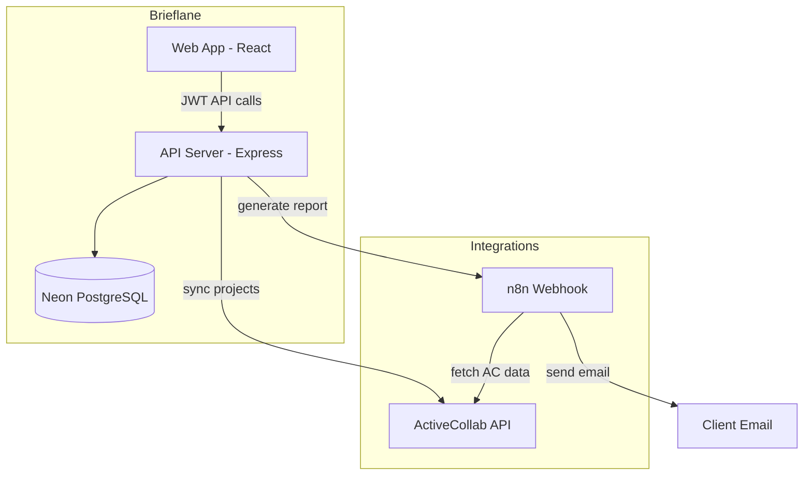

# Brieflane — Full Project Plan

A step-by-step plan to build **Brieflane**: an admin web app that syncs ActiveCollab projects into Neon, lets admins enrich project data, and triggers an existing n8n workflow to generate and email client reports.

---

## 1. Project Overview

### Goal

Replace manual project name/ID input in n8n with a secure web panel where authorized users can manage projects and trigger reports in one click.

### Core Users

| Role | Responsibilities |
|------|------------------|
| **Super Admin** | Manage users, system settings, all projects, trigger reports |
| **Project Manager** | Manage assigned projects, sync AC data, trigger reports |

### Success Criteria

- Users can log in with role-based access
- Projects can be synced from ActiveCollab or added manually
- Extra fields (client email, notes, etc.) are stored in Neon
- "Generate Report" triggers n8n with correct project data
- Report runs are logged (who, when, status)
- No ActiveCollab or n8n secrets exposed to the browser

---

## 2. Tech Stack (Recommended)

| Layer | Choice | Why |
|-------|--------|-----|
| Frontend | React + Vite + TypeScript | Fast dev, simple admin UI |
| UI | Tailwind + typed component folders (`client/src/components/`) | Consistent admin UI; reuse primitives across pages |
| Backend | Express + TypeScript | Straightforward API + integrations |
| Database | Neon PostgreSQL | Serverless Postgres, easy scaling |
| ORM | Prisma | Schema migrations, type safety |
| Auth | JWT + bcrypt | Simple for internal admin tool |
| Validation | Zod | Shared request validation |
| Hosting | Vercel (web) + Railway/Render (API) | Common, low ops |
| Email/Reports | n8n (existing) | Reuse current workflow |

---

## 3. System Architecture



### Data Flow: Generate Report

1. PM selects project in Brieflane
2. API validates role + project access
3. API creates `report_run` (status: `pending`)
4. API POSTs to n8n webhook with `ac_project_id`, name, client emails
5. n8n runs existing workflow → email client
6. Optional: n8n callback updates `report_run` to `completed` / `failed`

---

## 4. Database Schema (v1)

### `users`

| Column | Type | Notes |
|--------|------|-------|
| id | uuid/cuid | PK |
| email | string | unique |
| password_hash | string | |
| name | string | optional |
| role | enum | `SUPER_ADMIN`, `PROJECT_MANAGER` |
| status | enum | `ACTIVE`, `INACTIVE` |
| created_at | timestamp | |
| updated_at | timestamp | |

### `projects`

| Column | Type | Notes |
|--------|------|-------|
| id | uuid/cuid | internal PK |
| ac_project_id | int/string | unique, from ActiveCollab |
| name | string | from AC or manual |
| client_name | string | your field |
| client_email | string | primary recipient |
| report_recipients | json | extra emails array |
| custom_metadata | json | flexible extra fields |
| status | enum | `ACTIVE`, `ARCHIVED` |
| last_synced_at | timestamp | |
| created_at | timestamp | |
| updated_at | timestamp | |

### `project_assignments` (optional v1, recommended v1.1)

| Column | Type | Notes |
|--------|------|-------|
| user_id | fk | |
| project_id | fk | |
| assigned_at | timestamp | |

### `report_runs`

| Column | Type | Notes |
|--------|------|-------|
| id | uuid/cuid | |
| project_id | fk | |
| triggered_by_id | fk users | |
| status | enum | `pending`, `running`, `completed`, `failed` |
| n8n_execution_id | string | optional |
| error_message | text | optional |
| payload_snapshot | json | what was sent to n8n |
| created_at | timestamp | |
| completed_at | timestamp | optional |

### `system_settings` (Super Admin only)

| Key | Example |
|-----|---------|
| `activecollab_base_url` | `https://yourcompany.activecollab.com` |
| `n8n_webhook_url` | webhook URL |
| `n8n_webhook_secret` | shared secret |

*(Or keep these in env vars only for v1 — simpler.)*

---

## 5. API Endpoints (v1)

### Auth

| Method | Endpoint | Access |
|--------|----------|--------|
| POST | `/api/auth/login` | public |
| POST | `/api/auth/logout` | authenticated |
| GET | `/api/auth/me` | authenticated |

### Users (Super Admin)

| Method | Endpoint | Access |
|--------|----------|--------|
| GET | `/api/users` | Super Admin |
| POST | `/api/users` | Super Admin |
| PATCH | `/api/users/:id` | Super Admin |
| DELETE | `/api/users/:id` | Super Admin (soft deactivate) |
| GET | `/api/users/:id/assignments` | Super Admin |
| PUT | `/api/users/:id/assignments` | Super Admin — set PM project access |

### Projects

| Method | Endpoint | Access |
|--------|----------|--------|
| GET | `/api/projects` | both roles (PM: assigned only) |
| GET | `/api/projects/:id` | both |
| POST | `/api/projects` | both (manual create) |
| PATCH | `/api/projects/:id` | both |
| DELETE | `/api/projects/:id` | Super Admin (archive) |
| POST | `/api/projects/sync` | both — fetch from AC, upsert |
| GET | `/api/projects/ac-preview` | both — list AC projects before import |

### Reports

| Method | Endpoint | Access |
|--------|----------|--------|
| POST | `/api/projects/:id/generate-report` | both |
| GET | `/api/report-runs` | both |
| GET | `/api/report-runs/:id` | both |

### Webhook (n8n callback — optional v1.1)

| Method | Endpoint | Access |
|--------|----------|--------|
| POST | `/api/webhooks/n8n/report-status` | secret header |

---

## 6. UI Pages (v1)

| Page | Super Admin | Project Manager |
|------|-------------|-----------------|
| Login | ✓ | ✓ |
| Dashboard (stats, recent reports) | ✓ | ✓ |
| Projects list | ✓ | ✓ (assigned) |
| Project detail / edit | ✓ | ✓ |
| Sync from ActiveCollab | ✓ | ✓ |
| Generate Report button | ✓ | ✓ |
| Report history | ✓ | ✓ |
| Users management | ✓ | ✗ |
| Settings (AC/n8n config) | ✓ | ✗ |

### Frontend component strategy

All pages **reuse** shared components instead of one-off markup. This keeps the admin UI consistent and reduces duplication.

#### Folder layout

```text
client/src/
  components/
    ui/           # Primitives: Button, Input, Card, Modal, DataTable, …
    layout/       # App shell: AppLayout
    routing/      # Route guards: ProtectedRoute, SuperAdminRoute
    domain/       # Shared feature UI used across pages (e.g. ReportRunTable)
    common/       # Cross-cutting UI: icons, ThemeToggle, AppToaster
  lib/
    toast.ts      # Re-export of Sonner toast API
  pages/
    <page-name>/          # One folder per route area
      <PageName>Page.tsx  # Page entry — routing, data fetching, composition
      components/         # UI used only on this page
      hooks/              # Hooks used only on this page
  hooks/                  # Shared hooks (e.g. useDebouncedValue)
```

| Layer | Location | Purpose |
|-------|----------|---------|
| **UI primitives** | `client/src/components/ui/` | Reusable building blocks: `Button`, `Input`, `Select`, `Textarea`, `Card`, `Badge`, `Avatar`, `Modal`, `PageHeader`, `DataTable` |
| **Layout** | `client/src/components/layout/` | App shell: `AppLayout` |
| **Routing** | `client/src/components/routing/` | Route guards: `ProtectedRoute`, `SuperAdminRoute` |
| **Domain composites** | `client/src/components/domain/` | Feature-specific but shared across pages (e.g. `ReportRunTable`) |
| **Common** | `client/src/components/common/` | Icons, theme toggle, `AppToaster` (Sonner), and other cross-cutting UI |
| **Pages** | `client/src/pages/<page-name>/` | Compose primitives + layout; hold data fetching and page logic only |
| **Page components** | `client/src/pages/<page-name>/components/` | Modals, forms, and sections used only on that page |
| **Page hooks** | `client/src/pages/<page-name>/hooks/` | Custom hooks scoped to a single page |

**Rules when building UI**

1. **Check existing components first** — search `components/ui/`, `components/domain/`, and sibling pages before writing new markup.
2. **Reuse or extend** — compose shared primitives; add variants or `className` rather than copying Tailwind into pages.
3. **Create shared components** — add to `components/ui/` (generic) or `components/domain/` (feature-specific, 2+ pages) only when reuse is clear.
4. **Keep pages thin** — extract page-only UI into `pages/<name>/components/`; extract page-only hooks into `pages/<name>/hooks/`.
5. **Icons** — import from `client/src/components/common/icons.tsx`; don't inline SVGs in pages.
6. **Toasts** — success feedback via `toast.success()` from `client/src/lib/toast.ts` (bottom-right, theme-aware via `AppToaster`). Keep errors inline in forms and modals.

**Standard page structure**

```tsx
// pages/projects/ProjectsPage.tsx
import { AppLayout } from '../../components/layout/AppLayout';
import { PageHeader } from '../../components/ui/PageHeader';
import { CreateProjectModal } from './components/CreateProjectModal';

export function ProjectsPage() {
  return (
    <AppLayout>
      <PageHeader title="…" description="…" action={<Button>…</Button>} />
      <Card>…</Card>
    </AppLayout>
  );
}
```

---

## 7. Environment Variables

```env
# App
NODE_ENV=production
PORT=4000
JWT_SECRET=...
WEB_ORIGIN=https://brieflane.yourdomain.com

# Neon
DATABASE_URL=postgresql://...

# ActiveCollab
ACTIVECOLLAB_BASE_URL=https://yourcompany.activecollab.com
ACTIVECOLLAB_API_TOKEN=...

# n8n
N8N_REPORT_WEBHOOK_URL=https://n8n.../webhook/generate-report
N8N_WEBHOOK_SECRET=...

# Bootstrap (first Super Admin)
BOOTSTRAP_ADMIN_EMAIL=...
BOOTSTRAP_ADMIN_PASSWORD=...
```

---

## 8. Step-by-Step Implementation Plan

### Phase 0 — Discovery & Setup (Step 1–3)

#### Step 1: Requirements Lock

**Tasks**

- Document current n8n workflow inputs (exact fields: project id, name, email, etc.)
- List ActiveCollab API endpoints the workflow uses
- Define report trigger payload (JSON contract between Brieflane ↔ n8n)
- Confirm PM scope: all projects vs assigned only

**Deliverable:** 1-page spec with webhook payload example

**Acceptance:** n8n team agrees payload replaces manual fields

---

#### Step 2: Repo & Monorepo Scaffold

**Tasks**

- Create repo `brieflane`
- Structure:

```text
brieflane/
  apps/
    web/
    api/
  packages/
    shared/
  prisma/
  docs/
```

- TypeScript, ESLint, Prettier
- `.env.example` for api and web

**Deliverable:** Runnable empty apps (web + api)

**Acceptance:** `npm run dev` starts both locally

---

#### Step 3: Neon + Prisma Setup

**Tasks**

- Create Neon project + database
- Prisma schema: `users`, `projects`, `report_runs`
- First migration
- Health check endpoint: `GET /api/health`

**Deliverable:** DB connected, migrations work

**Acceptance:** Health check returns OK from API

---

### Phase 1 — Auth & Users (Step 4–6)

#### Step 4: Authentication

**Tasks**

- Password hashing (bcrypt)
- Login endpoint → JWT
- `authMiddleware` on protected routes
- Bootstrap Super Admin on first deploy (env-based)
- Web: login page, token storage, protected routes

**Deliverable:** Login/logout works end-to-end

**Acceptance:** Invalid credentials rejected; valid login reaches dashboard

---

#### Step 5: Role-Based Access Control

**Tasks**

- `requireRoles('SUPER_ADMIN')` middleware
- Role on `User` model
- API guards on user-management routes
- Frontend: hide Users/Settings for PM

**Deliverable:** RBAC enforced on API and UI

**Acceptance:** PM cannot call Super Admin endpoints (403)

---

#### Step 6: User Management (Super Admin)

**Tasks**

- CRUD users API
- Create user with role + password
- Deactivate user (no hard delete v1)
- Web: Users table, add/edit modal

**Deliverable:** Super Admin can add PMs

**Acceptance:** New PM can log in with assigned role

---

### Phase 2 — Projects (Step 7–10)

#### Step 7: ActiveCollab Service

**Tasks**

- Server-side AC client (token in env)
- `listProjects()` — paginate if needed
- `getProject(id)` — single project
- Error handling (401, 404, timeout)
- Optional: short-lived cache (5–10 min)

**Deliverable:** `ActiveCollabService` module

**Acceptance:** API can list AC projects in dev with real token

---

#### Step 8: Project Sync & Manual CRUD

**Tasks**

- `POST /api/projects/sync` — upsert by `ac_project_id`
- Manual `POST /api/projects` when AC id known
- `PATCH` for client_email, client_name, custom_metadata
- List + detail pages in web
- Search/filter on project name

**Deliverable:** Projects visible and editable in UI

**Acceptance:** Sync imports AC projects; edits persist in Neon

---

#### Step 9: Project Assignments (PM Scoping)

**Tasks**

- `project_assignments` table
- Super Admin assigns PMs to projects
- PM list endpoint filters by assignment
- UI: assignment multi-select on user or project page

**Deliverable:** PM sees only assigned projects

**Acceptance:** PM cannot access unassigned project by URL id

---

#### Step 10: Project Detail UX Polish

**Tasks**

- Show AC fields + custom fields clearly
- "Last synced" timestamp
- Validation: client_email required before report
- Empty states and error messages

**Deliverable:** Production-ready project screens

**Acceptance:** Clear UX for sync, edit, validate

---

### Phase 3 — Reports & n8n (Step 11–13)

#### Step 11: n8n Webhook Integration

**Tasks**

- Map n8n manual inputs → webhook JSON body
- `POST /api/projects/:id/generate-report`
- Send secret header to n8n
- Create `report_run` before calling n8n
- Handle n8n timeout/errors → `failed` status

**Example payload**

```json
{
  "brieflaneProjectId": "clx...",
  "acProjectId": 12345,
  "projectName": "Client ABC",
  "clientEmail": "client@example.com",
  "reportRecipients": ["cc@company.com"],
  "customMetadata": {},
  "triggeredBy": "admin@company.com"
}
```

**Deliverable:** One-click report trigger from UI

**Acceptance:** n8n receives same data you used manually; email still sends

---

#### Step 12: Update n8n Workflow

**Tasks**

- Replace manual trigger with Webhook node
- Map webhook body to existing AC nodes
- Test with Brieflane API
- Document workflow in `docs/n8n-workflow.md`

**Deliverable:** n8n workflow fully webhook-driven

**Acceptance:** No manual project id/name input needed in n8n

---

#### Step 13: Report History UI

**Tasks**

- `GET /api/report-runs` with filters (project, date, status)
- Dashboard: recent runs, success/fail counts
- Project detail: report history tab
- Show error_message on failure

**Deliverable:** Full audit trail in UI

**Acceptance:** Every trigger visible with status and user

---

### Phase 4 — Hardening (Step 14–16)

#### Step 14: Security Review

**Tasks**

- Rate limit login and report trigger
- CORS only for web origin
- Helmet, input validation (Zod)
- Never log API tokens
- PM authorization on every project/report route

**Deliverable:** Security checklist completed

**Acceptance:** No secrets in client bundle; RBAC on all routes

---

#### Step 15: Testing

**Tasks**

- API unit tests: auth, RBAC, project sync (mock AC)
- Integration test: generate-report (mock n8n)
- Manual test script in `docs/testing.md`

**Deliverable:** CI runs tests on push

**Acceptance:** Core paths covered; manual E2E script documented

---

#### Step 16: Deployment

**Tasks**

- Deploy API (Railway/Render) + Neon connection
- Deploy web (Vercel)
- Production env vars
- Run migrations on deploy
- Smoke test: login → sync → generate report

**Deliverable:** Production URLs

**Acceptance:** Full flow works in prod

---

### Phase 5 — Optional Enhancements (Step 17+)

| Step | Feature | Priority |
|------|---------|----------|
| 17 | n8n callback webhook for `completed`/`failed` | High |
| 18 | Scheduled auto-sync (cron in API or n8n) | Medium |
| 19 | PDF storage (S3) + download in UI | Medium |
| 20 | Email preview before send | Low |
| 21 | Audit log (all admin actions) | Medium |
| 22 | 2FA for Super Admin | Low |
| 23 | Direct report generation (bypass n8n) | Future |

---

## 9. n8n ↔ Brieflane Contract (Define in Step 1)

Document this before coding Step 11.

### Brieflane → n8n (trigger)

- Required: `acProjectId`, `projectName`, `clientEmail`
- Optional: `reportRecipients`, `customMetadata`, `brieflaneProjectId`, `triggeredBy`

### n8n → Brieflane (callback, optional)

```json
{
  "reportRunId": "clx...",
  "status": "completed",
  "n8nExecutionId": "123",
  "errorMessage": null
}
```

---

## 10. Timeline Estimate

| Phase | Steps | Duration (1 dev) |
|-------|-------|------------------|
| Phase 0 | 1–3 | 2–3 days |
| Phase 1 | 4–6 | 3–4 days |
| Phase 2 | 7–10 | 5–7 days |
| Phase 3 | 11–13 | 3–4 days |
| Phase 4 | 14–16 | 3–4 days |
| **Total v1** | | **~3–4 weeks** |

With an existing n8n workflow and AC access, Phase 3 is often the fastest if the webhook payload is agreed early.

---

## 11. Risks & Mitigations

| Risk | Mitigation |
|------|------------|
| AC API rate limits | Cache project list; sync on demand not every page load |
| n8n downtime | Show clear errors; retry button; log failed runs |
| Wrong client email | Require email on project; confirm modal before generate |
| Token leakage | AC/n8n secrets only in API env |
| PM sees all projects | Implement assignments in Step 9 before go-live |

---

## 12. Definition of Done (v1 Launch)

- [x] Super Admin can create Project Managers
- [x] Projects synced from ActiveCollab into Neon
- [x] Custom fields (client email, etc.) editable and saved
- [x] PM sees only assigned projects (Step 9)
- [ ] Generate Report triggers n8n without manual input
- [ ] Report history shows status and who triggered it
- [ ] Deployed to production with Neon
- [ ] Docs: setup, env vars, n8n payload contract

> **Live progress:** see [IMPLEMENTATION_STATUS.md](./IMPLEMENTATION_STATUS.md)

---

## 13. What to Do First (This Week)

**Completed through Step 9.** Next priorities:

1. **Step 11** — n8n webhook + `POST /api/projects/:id/generate-report`
2. **Step 13** — Report history UI
3. **Step 12** — Update n8n workflow + `docs/n8n-workflow.md`

---

## Implementation notes (repo structure)

The codebase uses `client/` and `server/` instead of the `apps/web` + `apps/api` monorepo layout described in Step 2. Prisma schema and migrations live in `server/prisma/`.

**Frontend:** Shared components live under `client/src/components/` (typed subfolders: `ui/`, `layout/`, `routing/`, `domain/`, `common/`). Each page has its own folder under `client/src/pages/<name>/` with `components/` and `hooks/` subfolders — see §6 *Frontend component strategy*. Cursor rules in `.cursor/rules/reuse-components.mdc` enforce this for AI-assisted development.

---

## Naming Consistency

| Use | Suggested name |
|-----|----------------|
| Product / UI | **Brieflane** |
| Git repo | `brieflane` |
| Folder | `brieflane` |
| API / package scope | `@brieflane/api`, `@brieflane/web` (if monorepo) |
| DB name | `brieflane` or `brieflane_prod` |
| Env prefix | `BRIEFLANE_` |

### Optional taglines

- "Client reports from your project data"
- "Select a project. Send the brief."
